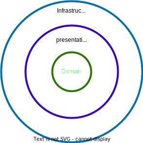
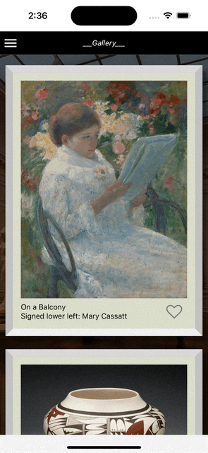

# Art works

ArtWorks is an application that allow users to navigate for the catalog of artworks exposed by the _Art Institute of Chicago API_.

The aplication has 3 screens, the main is the art gallery, that has an infinite scroll list to show users artworks, add to favorites, read a bit of information about that artwork and tap to see details.

The favorites are never lost because they are stored in the application storage, so stay calm when you open other applications or when you close appworks because your favorites are safe!!

Finally, you have a detialed view of the artwork, including, name, description, exhibition history, artist information and many other features (that will be included in next versions).

At this moment we don´t support notifications, but be patient, in future versions you will can share your favorites artworks with friends!


# Developer guide
>**Note**: Make sure you have completed the [React Native - Environment Setup](https://reactnative.dev/docs/environment-setup) instructions till "Creating a new application" step, before proceeding.

## Running the application

```bash
# on android
npx react-native run-android

# on ios
npx react-native run-ios
```

## Architecture


- **Infraestructure**: Has the responsability of interact directly with the outputs and inputs of the system also do the adaptors to the ports defined in the domain layer. Examples of this layer can be expose web services, connect to databases, read task queues, communicate apis, interact with os, etc.
- **Presentation**: Contains the ui of the application, has te responsability of interact direcly with the domain usecases for te application business flows.
- **Domain**: Represents all the business logic of the application which is the reason for the business to exist. It try to avoid the [Anemic anti pattern](https://martinfowler.com/bliki/AnemicDomainModel.html) and suport the [Tell dont ask principle](https://martinfowler.com/bliki/TellDontAsk.html). In this layer you can find the following aggregate patterns, domain services, entities, value objects, repositories (port), etc.

## Technical especifications
- [Inversify](https://www.npmjs.com/package/inversify) Dependency injection framework.
- [React Native Async Storage](https://github.com/react-native-async-storage/async-storage) Manage application storage.
- [Axios](https://axios-http.com/es/docs/intro) Manage application http traffic.
- [React Query](https://tanstack.com/query/v3/docs/react/overview) Handle http traffic with react hooks.
- [Detox](https://github.com/wix/Detox) End to end test framework.


To obtain more documentation on this type of architecture, it is recommended to read about [Hexagonal architecture and DDD](https://codely.tv/blog/screencasts/arquitectura-hexagonal-ddd/) (the application is not 100% based on this architecture, but application is based on some concepts) and [Clean architecture.](https://medium.com/globant/clean-architecture-for-mobile-to-be-or-not-to-be-2ffc8d46e402)

## Testing:
Te aplication has two types of tests, unit and end to end (e2e)
### Unit:
For the unit test, is used jest as the main framework to run them just type the following command:
```bash
npm run test
```
### e2e
For end to end testing is used [detox](https://blog.logrocket.com/react-native-end-to-end-testing-detox/) as main framework to run them, type the following command:
```
yarn e2e:ios 
```





>**Note**: Firs you should build application for e2e test, run 
```bash
yarn e2e:build:ios
```
.

## Linter

To lint application use the following command:
```bash
yarn prettier:fix
```
